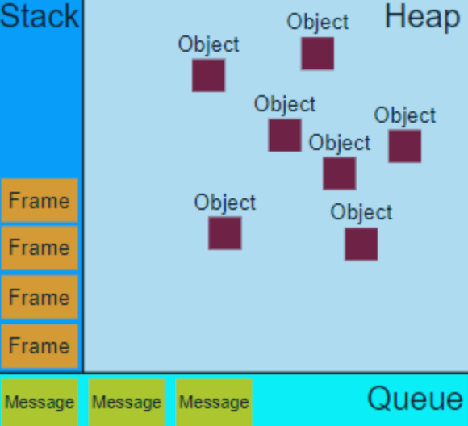

# 자바스크립트 엔진


### **실행 환경**

자바스크립트는 자바스크립트 엔진(JavaScript engine)이라 불리는 특별한 프로그램이 들어 있는 모든 디바이스에서도 동작합니다. 브라우저뿐만 아니라 서버에서도 실행이 가능합니다. 예를들면 V8엔진은 Node.js, Deno 런타임 시스템의 핵심 구성 요소입니다. 최초의 자바스크립트 엔진은 단순한 인터프리터였지만 모든 관련 최신 엔진은 Just-In-Time 컴파일을 사용합니다. 일반적으로 엔진은 여러 웹 브라우저 공급업체에서 개발하며 각각의 주요 브라우저가 있습니다. 브라우저에서 엔진은 DOM을 통해 렌더링 엔진과 함께 실행됩니다.

> \*_Runtime system_
>
> _대부분의 프로그래밍 언어에는 프로그램이 실행되는 환경을 제공하는 일종의 런타임 시스템이 있습니다. 이는 주로 실행 모델의 일부를 구현한 것을 의미하며 이 환경은 응용 프로그램 메모리 관리 , 프로그램이 변수 에 액세스하는 방법, 프로시저 간에 매개변수를 전달하는 메커니즘 , 운영 체제 와의 인터페이스 등을 비롯한 여러 문제를 해결할 수 있습니다 . 컴파일러 는 올바른 코드를 생성하기 위해 특정 런타임 시스템에 따라 가정합니다. 일반적으로 런타임 시스템은 스택 과 힙 을 설정하고 관리하는 책임이 있으며 가비지 수집 , 스레드 또는 언어에 내장된 기타 동적 기능을 포함할 수 있습니다._&#x20;

****

****

### 브라우저 가상 머신&#x20;

브라우저엔 '자바스크립트 가상 머신’이라 불리는 엔진이 내장되어 있습니다. 엔진의 종류는 다양한데, 엔진마다 특유의 코드네임이 있습니다.

* V8 – Chrome과 Opera에서 쓰입니다
* SpiderMonkey – Firefox에서 쓰입니다.
* IE는 버전에 따라 'Trident’나 'Chakra’라 불리는 엔진을 사용합니다. 'ChakraCore’는 Microsoft Edge에 사용되며, 'SquirrelFish’는 Safari에 사용됩니다.


### 동시성 모델&#x20;

엔진은 프로세스 각 단계마다 최적화를 진행합니다. 심지어 컴파일이 끝나고 실행 중인 코드를 감시하면서, 이 코드로 흘러가는 데이터를 분석하고, 분석 결과를 토대로 기계어로 전환된 코드를 다시 최적화하기도 합니다. 이런 과정을 거치면 스크립트 실행 속도는 더욱 더 빨라집니다. 자바스크립트는 이러한 엔진를 통하여 코드 실행, 이벤트 수집과 처리, 자바스크립트 엔진을 구동하는 환경(브라우저 또는 nodejs) 덕분에 큐에 놓인 하위 작업들을 담당하는 **이벤트 루프에 기반한 동시성(concurrency) 모델을 가질 수 있게 되었습니다.**

1. parsing : 엔진(브라우저라면 내장 엔진)이 스크립트를 읽습니다
2.  compile : 읽어 들인 스크립트를 기계어로 전환합니다(컴파일). 이 단계에서 스크립트를 bytecode로 컴파일하고 실행합니다.

    (일반적으로는 인터프리터방식이지만, v8의 경우 jit compile 방식, 스크립트 변화에 맞춘 최적화 방식 인터프리터+컴파일방식을 사용하고 있습니다.)
3. excution : 기계어로 전환된 코드가 실행됩니다. 기계어로 전환되었기 때문에 실행 속도가 빠릅니다.

> \*_Concurrent(동시성)_
>
> _자바스크립트는 웹 브라우저를 통하여 코드 실행, 이벤트 수집과 처리, 큐에 놓인 하위 작업들을 담당하는 이벤트 루프에 기반한 동시성(concurrency) 모델을 가지고 있게 되었습니다. 이 모델은 C 또는 Java와 같은 언어와 완전히 다릅니다. **실제 물리적으로 동시에 일어나는 것이 아니라, 흐름을 실행시키는 것은 하나(cpu 코어 혹은 쓰레드)지만 작은 타임 슬라이스 단위로 다른 흐름을 돌아가면서 실행시켜서 동시에 일어나는 것처럼 보이게 하는 방식입니다. 논리적인 의미에 동시 실행으로 볼 수 있습니다.**_
>
> \*_Parallel(병렬성)_
>
> _실제로 흐름을 실행 시키는 것(cpu코어 혹은 쓰레드)이 복수개여서, 각각 실행 흐름을 할당받아 동시에 실행 시킵니다. 물리적인 의미에 동시 실행입니다. 자바스크립트 언어 스펙이 싱글쓰레드이므로, 병렬성은 지원할 수 없습니다. 대신 동시성을 지원합니다._

****

****

### **optimization(최적화)**

모던 자바스크립트 엔진들은 아래 묘사된 개념들을 구현하고 최적화 합니다.




* [Stack](https://developer.mozilla.org/ko/docs/Web/JavaScript/EventLoop#stack)&#x20;

함수 호출은 프레임들의 스택을 형성합니다. 다른 프로그래밍 언어에서 사용하는 함수 호출시 할당, 리턴 시 해제되는 그 콜 스택입니다. 함수가 호출될 때 마다 해당 함수에 대한 스택 프레임이 생성되고, 해당 스택 프레임은 해당 함수의 인자와 지역변수들을 저장합니다. 함수가 리턴될 때 해당 함수의 스택 프레임은 해제됩니다. 실제로 V8과 같은 자바스크립트 엔진은 단일 호출 스택(Call Stack)을 사용하며, 요청이 들어올 때마다 해당 요청을 순차적으로 호출 스택에 담아 처리할 뿐입니다.

* [Heap](https://developer.mozilla.org/ko/docs/Web/JavaScript/EventLoop#heap)&#x20;

객체들은 힙 안에 할당됩니다. 힙은 구조화되지 않은 넓은 메모리 영역을 지칭합니다. 일반적으로 힙은 동적으로 할당된 변수나 메모리 등을 포함합니다. 자바스크립트는 인터프리터형 스크립트 언어이므로 선언된 것들을 저장할 수 있지만, 지역변수나 함수 인자들은 스택에 저장되므로, 전역 객체와 같은 것들이 힙에 저장됩니다.

* [Queue](https://developer.mozilla.org/ko/docs/Web/JavaScript/EventLoop#queue)

JavaScript 런타임은 처리 할 메시지 목록 인 메시지 대기열을 사용합니다. 각 메시지에는 메시지를 처리하기 위해 호출되는 관련 함수가 있습니다. 자바스크립트 런타임에서 큐는 메시지 큐이다. 이 큐를 이용해서 자바스크립트는 동시성 모델을 지원하며, 큐에는 처리해야 할 메시지들이 저장되어 있습니다. 메시지는 처리해야할 함수들의 셋이라고 볼 수 있으며, 큐는 메시지 단위로 처리한다. 큐가 메시지를 처리하는 로직은 다음과 같습니다.


### 런타임 환경

_콜스택, 이벤트루프, 렌더 큐, 콜백 큐, 웹 API, v8(힙, 메모리)로 구성됩니다._


실제로 V8과 같은 자바스크립트 엔진은 단일 호출 스택(Call Stack)을 사용하며, 요청이 들어올 때마다 해당 요청을 순차적으로 호출 스택에 담아 처리할 뿐입니다. 그렇다면 비동기 요청은 어떻게 이루어지며, 동시성에 대한 처리는 누가 하는 걸까요? 바로 이 자바스크립트 엔진을 구동하는 환경, 즉 브라우저나 Node.js가 담당합니다

위 그림에서 볼 수 있듯이 실제로 우리가 비동기 호출을 위해 사용하는 `setTimeout`이나 `XMLHttpRequest`와 같은 함수들은 자바스크립트 엔진이 아닌 Web API 영역에 따로 정의되어 있습니다. 또한 이벤트 루프와 태스크 큐와 같은 장치도 자바스크립트 엔진 외부에 구현되어 있는 것을 볼 수 있습니다.


Node.js 환경도 브라우저의 환경과 비슷한 구조를 가지는 것을 볼 수 있습니다. 잘 알려진 대로 Node.js는 비동기 IO를 지원하기 위해 [libuv](https://libuv.org/)라이브러리를 사용하며, 이 libuv가 이벤트 루프를 제공합니다. **자바스크립트 엔진은 비동기 작업을 위해 Node.js의 API를 호출**하며, 이때 넘겨진 콜백은 libuv의 이벤트 루프를 통해 스케쥴되고 실행됩니다. 자바스크립트가 '단일 스레드' 기반의 언어라는 말은 '자바스크립트 엔진이 단일 호출 스택을 사용한다'는 관점에서만 사실이라 볼 수 있습니다. 실제 자바스크립트가 구동되는 환경(브라우저, Node.js등)에서는 주로 여러 개의 스레드가 사용되며, 이러한 구동 환경이 단일 호출 스택을 사용하는 자바 스크립트 엔진과 상호 연동하기 위해 사용하는 장치가 바로 '이벤트 루프'입니다.


### _Event loop_

_이벤트, 사용자 상호작용, 스크립트, 렌더링, 네트워킹 등을 조정하려면 사용자는 이벤트루프를 사용해야 합니다. 이벤트루프에는 하나 이상의 작업대기열이 있습니다 작업대기열이란 작업(함수)의 집합입니다. Callback event Queue에서 하나씩 꺼내서 동작시키는 루프를 말합니다._

```jsx
// 지속적으로 감시
while(queue.waitForMessage()){
  queue.processNextMessage();
}
```


`queue.waitForMessage()` 함수는 현재 아무 메시지도 없다면 새로운 메시지 도착을 동기적으로 기다립니다.



### Run-to-completion

Run-to-completion이란, 하나의 메시지 처리가 시작되면 이 메시지의 처리가 끝날 때까지는 다른 어떤 작업도 중간에 끼어들지 못한다는 의미입니다. 이것은 함수가 실행될 때마다 미리 비워질 수 없고 다른 코드가 실행되기 전에 완전히 실행되며 함수가 조작하는 데이터를 수정할 수 있다는 사실을 포함하여 프로그램에 대한 추론을 할 때 좋은 속성을 제공합니다. 이것은 C와는 다릅니다. 예를 들어 함수가 쓰레드에서 실행된다면 런타임 시스템이 다른 쓰레드에서 다른 코드를 실행하기 위해 어느 시점에서 멈출 수 있습니다.

이 모델의 부정적인 면은 어떤 메시지가 완료되기 까지 지나치게 오래 걸린다면 웹 어플리케이션은 클릭이나 스크롤과 같은 사용자 인터랙션을 처리할 수 없게 됩니다. 브라우저는 이러한 상황을 "a script is taking too long to run"과 같은 대화상자로 완화 합니다. 추천되는 좋은 방법은 메시지 처리를 짧도록 만드는 것과 하나의 메시지를 여러개의 메시지로 나누는 것 입니다.

__

__

### zero delay

Zero delay는 실제로 0ms 후에 콜백이 시작된다는 의미는 아닙니다. `0`ms 지연된 `[setTimeout]`은 주어진 간격 후에 콜백 함수를 실행하지 않습니다.

실행은 큐에 대기중인 작업 수에 따라 다릅니다. 아래 예에서, 콜백의 메시지가 처리되기 전에 콘솔에 `"this is just message"`메시지가 기록됩니다. 왜냐하면 지연(delay)은 보장된 시간이 아니라 요청을 처리하기 위해 필요한 최소의 시간이기 때문입니다.

기본적으로 `setTimeout`은 `setTimeout`에 대한 특정 시간 제한을 지정 했더라도 대기중인 메시지의 모든 코드가 완료 될 때까지 대기해야합니다.


### never blocking

이벤트 루프 모델의 무척 재밌는 부분은 다른 언어와 달리 자바스크립트는 결코 Block하지 않는다는 것입니다. I/O 처리는 흔히 이벤트와 콜백으로 처리 됩니다. 그래서 응용프로그램이 [IndexedDB](https://developer.mozilla.org/ko/docs/Web/API/IndexedDB\_API) query 반환을 기다리고 있거나 [XHR](https://developer.mozilla.org/ko/docs/Web/API/XMLHttpRequest) 요청 반환을 기다릴 때에도 여전히 사용자 입력과 같은 다른 것을을 처리할 수 있습니다

__

__
